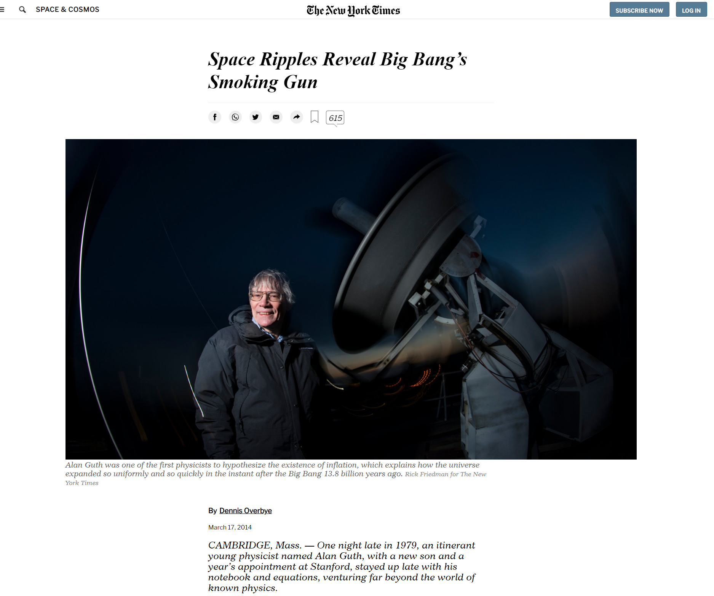
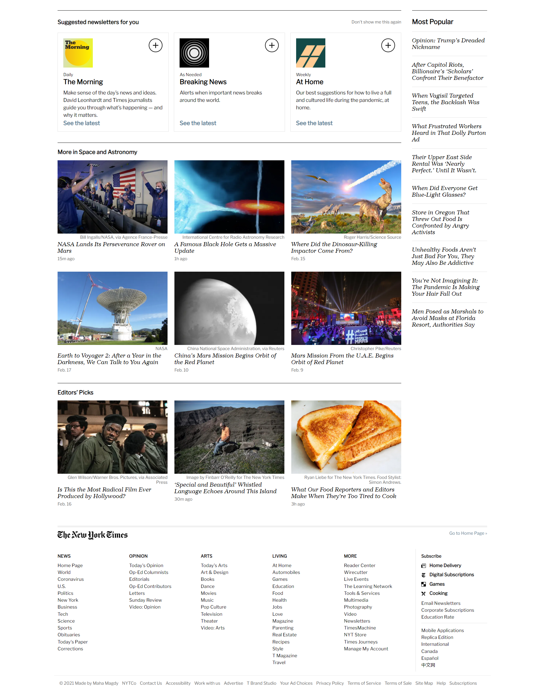

#   The-New-York-Times-Article

> HTML and CSS project

This is a clone of article by the New York Times webpage using HTML & CSS: https://www.nytimes.com/2014/03/18/science/space/detection-of-waves-in-space-buttresses-landmark-theory-of-big-bang.html

##  Built With

- HTML
- CSS

## Live Demo

[Live Demo Link](https://maha-magdy.github.io/The-New-York-Times-Article/) 

## Authors

   Maha Magdy

- GitHub: [Maha-Magdy](https://github.com/Maha-Magdy)
- Twitter: [@Maha_M_Abdelaal](https://twitter.com/Maha_M_Abdelaal)
- LinkedIn: [Maha Magdy](https://www.linkedin.com/in/maha-magdy-18a8a7116/)

## Contributing

Contributions, issues, and feature requests are welcome!

## Show your support

Give a star if you like this project!

## Acknowledgments

- The New York Times
- Dennis Overbye

